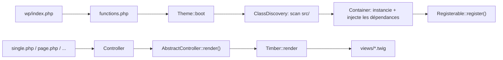

# Thème WordPress — Starter MVC (Bedrock + Timber/Twig)

Thème "starter" orienté objet, pensé pour être réutilisé comme base sur tous les projets WordPress/Bedrock : architecture MVC, injection de dépendances, auto-découverte des classes, DTO, repositories, AJAX sécurisé, optimisations de performance et pipeline d'assets Vite avec HMR.

Ce document décrit l'architecture, les conventions et **toutes les modifications apportées** au thème pour en faire un socle solide et rapide à démarrer.

## Sommaire

- [Stack technique](#stack-technique)
- [Démarrage rapide](#démarrage-rapide)
- [Architecture générale](#architecture-générale)
- [Auto-découverte des classes (`Registerable`)](#auto-découverte-des-classes-registerable)
- [Attributs `#[Condition]` et `#[OnHook]`](#attributs-condition-et-onhook)
- [Structure des dossiers `src/`](#structure-des-dossiers-src)
- [Cycle de vie d'une page (Controller → Twig)](#cycle-de-vie-dune-page-controller--twig)
- [Ajouter une nouvelle page](#ajouter-une-nouvelle-page)
- [Models / Entités Timber](#models--entités-timber)
- [DTO (Data Transfer Objects)](#dto-data-transfer-objects)
- [Repositories & cache](#repositories--cache)
- [AJAX sécurisé](#ajax-sécurisé)
- [Sécurité](#sécurité)
- [Performance](#performance)
- [Options du site (ACF) & contexte global Twig](#options-du-site-acf--contexte-global-twig)
- [Commentaires](#commentaires)
- [Assets, Vite & HMR](#assets-vite--hmr)
- [Conventions de code](#conventions-de-code)
- [Récapitulatif des correctifs apportés](#récapitulatif-des-correctifs-apportés)

## Stack technique

- **[Bedrock](https://roots.io/bedrock/)** — structure WordPress moderne (Composer, `.env`, séparation config/web)
- **[Timber v2](https://timber.github.io/docs/)** — moteur de vues Twig pour WordPress
- **PHP 8.1+** — `readonly`, attributs natifs, `strict_types`, injection de dépendances
- **[Vite](https://vitejs.dev/)** — build JS/SCSS avec Hot Module Replacement en développement
- **SCSS** (architecture 7-1) + PostCSS (autoprefixer, PurgeCSS) + LightningCSS
- **ACF / Secure Custom Fields** + `vinkla/extended-acf` — champs déclarés en PHP (fluent API)

## Démarrage rapide

```bash
# Dépendances PHP (à la racine du projet Bedrock)
composer install

# Dépendances JS + build (dans web/app/themes/default)
cd web/app/themes/default
pnpm install

pnpm dev     # build watch + serveur Vite (HMR) sur http://localhost:1337
pnpm build   # build de production dans dist/
```

Copiez `.env.example` en `.env` à la racine du projet et renseignez au minimum `WP_HOME`, `WP_SITEURL`, les accès base de données et `VITE_DEV_SERVER` pour le HMR. Les variables `SMTP_*` sont nécessaires si vous voulez que `Theme\Services\MailService` route les emails via un vrai serveur SMTP.

## Architecture générale

Le thème suit une architecture **MVC + services**, avec un mini-conteneur d'injection de dépendances et une auto-découverte des classes — inspirée de frameworks comme Laravel/Symfony, mais réduite à l'essentiel pour rester lisible dans un thème WordPress.



- **`Theme\Core\Container`** : conteneur DI minimaliste (singleton). Résout automatiquement les dépendances d'un constructeur par réflexion — pas besoin de tout enregistrer manuellement, il suffit de type-hinter les paramètres.
- **`Theme\Core\ClassDiscovery`** : scanne récursivement `src/`, retient les classes qui implémentent `Registerable`, puis les boote en respectant leurs attributs `#[Condition]` / `#[OnHook]`.
- **`Theme\Core\Theme::boot()`** : point d'entrée appelé depuis `functions.php`.
- **`Theme\Core\AbstractController`** : base commune à tous les contrôleurs de page (voir plus bas).
- **`Theme\Core\AjaxController`** *(nouveau)* : base commune à tous les endpoints AJAX.

### Pourquoi cette approche ?

Ajouter une fonctionnalité (service, controller AJAX, champ ACF, shortcode...) revient simplement à **créer une classe implémentant `Registerable` dans `src/`** : elle sera automatiquement détectée et démarrée, sans registre central à maintenir. C'est le principal gain de temps de ce starter.

## Auto-découverte des classes (`Registerable`)

```php
interface Registerable
{
    public function register(): void;
}
```

Toute classe concrète de `src/` qui implémente cette interface est :
1. Instanciée via le `Container` (ses dépendances de constructeur sont résolues automatiquement) ;
2. "bootée" via `ClassDiscovery::boot()`, qui vérifie ses attributs `#[Condition]` puis accroche `register()` au hook WordPress déclaré (`init` par défaut).

## Attributs `#[Condition]` et `#[OnHook]`

```php
#[Condition('is_admin')]                    // n'exécute register() que si is_admin() est vrai
#[Condition('function_exists', ['acf_add_options_page'])]
#[OnHook('after_setup_theme', priority: 5)] // hook + priorité personnalisés (défaut: 'init', 10)
class MonService implements Registerable
{
    public function register(): void { /* ... */ }
}
```

## Structure des dossiers `src/`

| Dossier | Rôle |
|---|---|
| `Core/` | Conteneur DI, auto-discovery, classes de base `AbstractController` / `AjaxController`, exceptions |
| `Contracts/` | Interfaces (`Registerable`, `Renderable`) |
| `Attributes/` | Attributs PHP natifs (`#[Condition]`, `#[OnHook]`) |
| `Controllers/` | Un contrôleur par type de template WordPress (thin controllers) |
| `Ajax/` | Endpoints AJAX (`admin-ajax.php`), un fichier par action |
| `Models/` | Entités Timber (`Post`, `Page`, ...) : logique métier sur le contenu |
| `DTO/` | Objets de transfert de données, immuables, validés |
| `Repositories/` | Accès aux données (requêtes, options ACF), avec mise en cache |
| `Services/` | Services transverses (assets, sécurité, perf, mail, Twig, DB...) |
| `Admin/` | Personnalisations de l'administration WordPress |
| `Fields/` | Déclaration des champs ACF (fluent API `vinkla/extended-acf`) |
| `Shortcodes/` | Shortcodes WordPress |
| `Helpers/` | Utilitaires sans état (HMR, ...) |

## Cycle de vie d'une page (Controller → Twig)

Chaque template racine WordPress (`page.php`, `single.php`, `archive.php`...) est **volontairement minimal** : il ne fait que déléguer à un contrôleur.

```php
// page.php
use Theme\Controllers\PageController;
use Theme\Core\AbstractController;

AbstractController::dispatch(PageController::class);
```

```php
// src/Controllers/PageController.php
class PageController extends AbstractController
{
    public function view(): string
    {
        return 'base/page.twig';
    }

    protected function data(): array
    {
        return [
            // Données spécifiques à injecter dans le contexte Twig
        ];
    }
}
```

`AbstractController::dispatch()` résout le contrôleur via le `Container` (ses dépendances — repositories, services... — sont injectées automatiquement), construit le contexte Timber (`Timber::context()` + `data()`) et rend la vue Twig.

## Ajouter une nouvelle page

1. Créer le fichier racine WordPress (ex. `page-a-propos.php`) qui dispatch un contrôleur.
2. Créer le contrôleur dans `src/Controllers/`, en étendant `AbstractController`.
3. Injecter au besoin un repository/service via le constructeur (résolu automatiquement).
4. Créer la vue Twig correspondante dans `views/`.

Aucune classe à enregistrer manuellement : le contrôleur est simplement instancié à la demande par `AbstractController::dispatch()`.

## Models / Entités Timber

`src/Models/Post.php` et `src/Models/Page.php` étendent `Timber\Post` : ce sont les **entités** du thème. Elles centralisent la logique métier liée au contenu (temps de lecture, résumé, fil d'ariane...) plutôt que de la disperser dans les vues.

```php
class Post extends TimberPost
{
    public function readingTime(int $wordsPerMinute = 200): int { /* ... */ }
    public function summary(int $length = 160): string { /* ... */ }
    public function hasThumbnail(): bool { /* ... */ }
}
```

Le mapping est déclaré dans `Theme\Services\TimberSetup` via le filtre `timber/post/classmap`, donc `Timber::get_post()` / `Timber::get_posts()` retournent directement ces classes enrichies.

## DTO (Data Transfer Objects)

*(nouveau)* Les DTO structurent et **sanitizent** les données qui traversent une frontière (requête HTTP → PHP), au lieu de manipuler des tableaux `$_POST` non typés directement dans un contrôleur.

- **`Theme\DTO\ContactFormDTO`** : construit depuis `$_POST` (`fromRequest()`), sanitize chaque champ (`sanitize_text_field`, `sanitize_email`...), expose `validate()` / `isValid()`.
- **`Theme\DTO\SiteOptionsDTO`** : représentation typée et immuable (`readonly`) de la page d'options ACF.

```php
$dto = ContactFormDTO::fromRequest($_POST);

if (!$dto->isValid()) {
    // $dto->validate() -> ['email' => 'Une adresse email valide est requise.']
}
```

## Repositories & cache

*(nouveau)* Les repositories centralisent l'accès aux données et permettent de mettre en cache ce qui peut l'être, sans polluer les contrôleurs.

- **`Theme\Services\Cache`** : wrapper simple autour des transients WordPress (`remember()` façon "get or set", `forget()`). Utilise automatiquement un cache d'objets persistant (Redis/Memcached) s'il est configuré sur l'environnement.
- **`Theme\Repositories\PostRepository`** : `fromMainQuery()` (jamais caché : dépend de la pagination/des filtres courants) et `latest()` (caché 15 min, pour widgets "articles récents", sidebars, etc.).
- **`Theme\Repositories\SiteOptionsRepository`** : lit la page d'options ACF, la met en cache 1h et **invalide automatiquement le cache** dès qu'elle est sauvegardée (hook `acf/save_post`).

```php
class FrontPageController extends AbstractController
{
    public function __construct(private PostRepository $posts) {}

    protected function data(): array
    {
        return ['latest_posts' => $this->posts->latest('post', 3)];
    }
}
```

⚠️ Ne jamais mettre en cache la requête principale d'une page (archive, recherche, pagination) : seules les requêtes "secondaires" (listes annexes, widgets) doivent l'être.

## AJAX sécurisé

*(nouveau)* `Theme\Core\AjaxController` est une classe abstraite qui prend en charge :

- le branchement automatique sur `wp_ajax_{action}` / `wp_ajax_nopriv_{action}` (via `Registerable`, donc auto-découvert) ;
- la **vérification de nonce** (protection CSRF) sur chaque appel ;
- les réponses JSON standardisées (`wp_send_json_success` / `wp_send_json_error`).

Il ne reste qu'à déclarer le nom de l'action et implémenter `handle()` :

```php
namespace Theme\Ajax;

class ContactFormAjax extends AjaxController
{
    protected function action(): string
    {
        return 'contact_form';
    }

    protected function handle(): array
    {
        $dto = ContactFormDTO::fromRequest($_POST);
        // ... validation, envoi d'email ...
        return ['message' => 'Message envoyé !'];
    }
}
```

Côté front, `Theme\Services\AssetManager` injecte `window.themeAjax = { url, nonce }` dans `<head>` (voir `localizeAjax()`), et `assets/js/features/contact-form.js` illustre un appel `fetch()` complet :

```js
const formData = new FormData(form);
formData.append('action', 'contact_form');
formData.append('nonce', window.themeAjax.nonce);

const response = await fetch(window.themeAjax.url, { method: 'POST', body: formData });
```

**Exemple fourni : le formulaire de contact** (`views/pages/contact.twig` → `assets/js/features/contact-form.js` → `Theme\Ajax\ContactFormAjax`) sert de modèle pour créer vos propres endpoints (favoris, filtres AJAX, panier, newsletter...).

## Sécurité

Récapitulatif des protections actives (`Theme\Services\Security`, `Theme\Services\PerformanceOptimizer`, `Theme\Core\AjaxController`, DTO) :

| Protection | Où |
|---|---|
| Headers de sécurité (`HSTS`, `X-Frame-Options`, `X-Content-Type-Options`, `Referrer-Policy`, `Permissions-Policy`) | `Security::addSecurityHeaders()` |
| Désactivation de XML-RPC | `Security::disableXmlRpc()` |
| Masquage des utilisateurs via l'API REST (`/wp/v2/users`) | `Security::disableRestUsers()` |
| Messages d'erreur de connexion génériques (pas d'énumération de comptes) | `Security::hideLoginErrors()` |
| Nom de session custom (dérivé des clés secrètes du site) | `Security::customizeSessionName()` |
| Nonce obligatoire (CSRF) sur tous les endpoints AJAX | `Theme\Core\AjaxController::verifyNonce()` |
| Sanitization systématique des entrées (DTO) | `Theme\DTO\*::fromRequest()` |
| Honeypot anti-spam sur le formulaire de contact | `views/pages/contact.twig` + `ContactFormDTO::validate()` |
| Rate limiting (3 tentatives / minute / IP) sur le formulaire de contact | `ContactFormAjax::guardRateLimit()` |
| Échappement automatique des sorties | Twig (auto-escaping natif) |
| Nonces sur les actions d'administration sensibles (duplication d'article) | `Admin\DuplicatePost` |

**Bonnes pratiques à conserver en développant sur ce starter :**
- Toujours passer les entrées utilisateur par un DTO avant de les utiliser.
- Toujours étendre `AjaxController` pour un nouvel endpoint AJAX plutôt que de brancher `wp_ajax_*` à la main (sinon pas de vérification de nonce).
- Ne jamais faire confiance à `$_GET`/`$_POST` dans un contrôleur de page : ce sont des vues, pas des points d'entrée d'action.

## Performance

*(nouveau)* `Theme\Services\PerformanceOptimizer` :

- Retire le méta `generator`, les liens `RSD`/`wlwmanifest`/`shortlink`/`rel=next,prev` du `<head>`.
- Désactive les scripts/styles d'émojis (une requête + du CSS inline en moins sur chaque page).
- Désactive la découverte oEmbed (`wp-embed.js` non chargé si non utilisé).
- Réduit la fréquence de l'API Heartbeat (60s) et la désactive complètement sur le front public (gardée en admin pour l'autosave/verrouillage d'édition).

Autres optimisations déjà en place / ajoutées :

- **Cache applicatif** via `Theme\Services\Cache` (repositories, options ACF) — voir [Repositories & cache](#repositories--cache).
- **Vite** : bundle unique par entrée, `PurgeCSS` (retire le CSS inutilisé en production), `LightningCSS` pour la minification, `autoprefixer` piloté par `browserslist`.
- **`Theme\Services\DatabaseOptimizer`** : purge planifiée des révisions, transients expirés, commentaires spam, et `OPTIMIZE TABLE` (hook `wp_scheduled_delete`).
- **Modèles Timber** légers : pas de requêtes N+1 cachées, `no_found_rows` utilisé dans les requêtes de repository qui n'ont pas besoin de pagination.

## Options du site (ACF) & contexte global Twig

Les champs déclarés dans `Theme\Fields\AdminPageOptionsFields` (page "Options du site" : contact, réseaux sociaux, destinataires des emails du formulaire de contact) sont désormais exposés **partout dans Twig** via la variable globale `site_options` (voir `Theme\Services\TimberSetup::registerGlobalContext()`) :

```twig
{{ site_options.phone }}
{{ site_options.email }}
{{ site_options.address }}

    {# ... #}

```

Ces valeurs sont mises en cache (1h) par `SiteOptionsRepository` et invalidées automatiquement à l'enregistrement de la page d'options — inutile de vider un cache manuellement après une modification dans l'admin.

## Commentaires

**Correctif important** : `comments.php` chargeait par erreur `ErrorController` (page 404) au lieu d'un vrai template de commentaires — les commentaires étaient donc cassés. C'est corrigé :

- `comments.php` construit le contexte Timber et rend `views/partials/comments.twig` (utilise `comment_form()` / `wp_list_comments()` de WordPress pour rester compatible avec les plugins anti-spam/commentaires).
- `views/singles/post.twig` et `views/base/single.twig` appellent désormais `{{ function('comments_template') }}` pour charger `comments.php` (WordPress ne peut inclure qu'un fichier nommé littéralement `comments.php`, jamais un `.twig`).

## Assets, Vite & HMR

- En développement (`VITE_DEV_SERVER` défini), `Theme\Services\AssetManager` charge les assets directement depuis le serveur Vite en ES modules (HMR actif, y compris rechargement complet sur modification d'un `.php`/`.twig`, voir `vite.config.js`).
- En production, il charge `dist/style.css` et `dist/app.js` générés par `pnpm build`.
- `Theme\Helpers\HmrHelper` centralise la détection du mode (dev/prod) et l'URL du serveur Vite.
- `Theme\Services\TwigExtensions::asset()` permet de résoudre le bon chemin (dev ou prod) directement depuis Twig : `{{ asset('imgs/logo.svg') }}`.
- `Theme\Services\TwigExtensions` enregistre aussi les fonctions de traduction WordPress dans Twig — **absentes par défaut de Timber v2** (correctif) : `{{ __('Texte', 'default') }}`, `{{ _e(...) }}`, `{{ _n(...) }}`, `{{ _x(...) }}`.

## Conventions de code

- `declare(strict_types=1)` + `defined('ABSPATH') || die();` en tête de chaque fichier PHP du thème.
- Indentation par tabulations (convention déjà en place dans tout le thème).
- `phpcs.xml` (PSR-2, `composer test`) : le thème respecte déjà largement PSR-2 dans son style ; seule l'indentation par tabulations (au lieu d'espaces) diverge du preset strict — c'est une convention assumée du projet, pas une régression. Lancez `vendor/bin/phpcbf` uniquement si vous souhaitez uniformiser tout le dépôt vers des espaces.
- PHP **8.1 minimum** requis (le thème utilise des propriétés `readonly` et des attributs natifs) — mis à jour dans `composer.json` (`"php": ">=8.1"`).

## Récapitulatif des correctifs apportés

| # | Modification | Pourquoi |
|---|---|---|
| 1 | `comments.php` chargeait `ErrorController` (bug) | Commentaires cassés sur tous les articles |
| 2 | `{{ __(...) }}` utilisé dans `base/search.twig` sans être enregistré dans Twig | Erreur Twig sur la page de recherche |
| 3 | Ajout des DTO (`ContactFormDTO`, `SiteOptionsDTO`) | Sanitization/validation centralisées, plus de tableaux non typés |
| 4 | Ajout des repositories (`PostRepository`, `SiteOptionsRepository`) + `Cache` | Contrôleurs plus fins, requêtes coûteuses mises en cache |
| 5 | Ajout de `Theme\Core\AjaxController` + `ContactFormAjax` | AJAX sécurisé (nonce) prêt à l'emploi, réutilisable |
| 6 | `AssetManager` expose `window.themeAjax` | Permet d'appeler les endpoints AJAX en JS sans configuration manuelle |
| 7 | Ajout de `PerformanceOptimizer` | Nettoyage du `<head>`, émojis/oEmbed/Heartbeat désactivés |
| 8 | `ArchiveController` enrichi (`term`, `author`, `title`) | `category.php`/`tag.php`/`author.php`/`taxonomy.php`/`date.php` partagent ce contrôleur : ils avaient accès à zéro contexte spécifique |
| 9 | `site_options` exposé globalement dans Twig | Évite de répéter `get_field(..., 'options')` partout |
| 10 | Formulaire de contact fonctionnel (vue + JS + AJAX + SCSS) | `ContactController`/`contact.twig` étaient des coquilles vides |
| 11 | Textdomain uniformisé sur `default` (`Security`, `DuplicatePost` utilisaient `theme`) | Cohérence des traductions |
| 12 | `composer.json`: PHP `>=8.0` → `>=8.1` | Le code utilise déjà des propriétés `readonly` (8.1+) |

